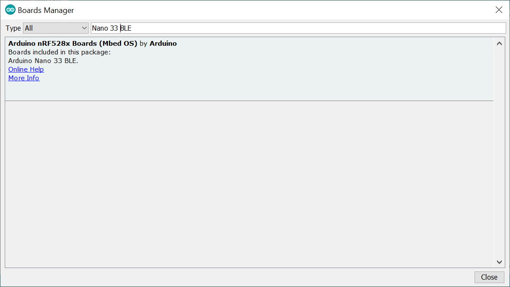
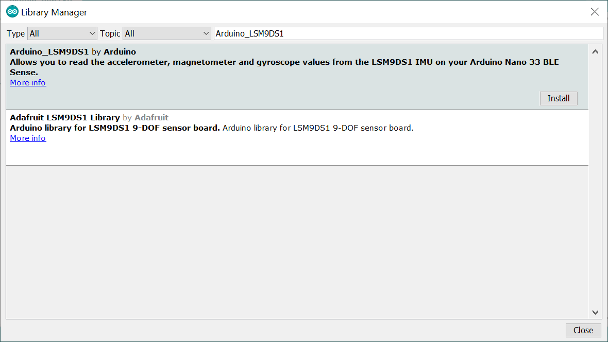
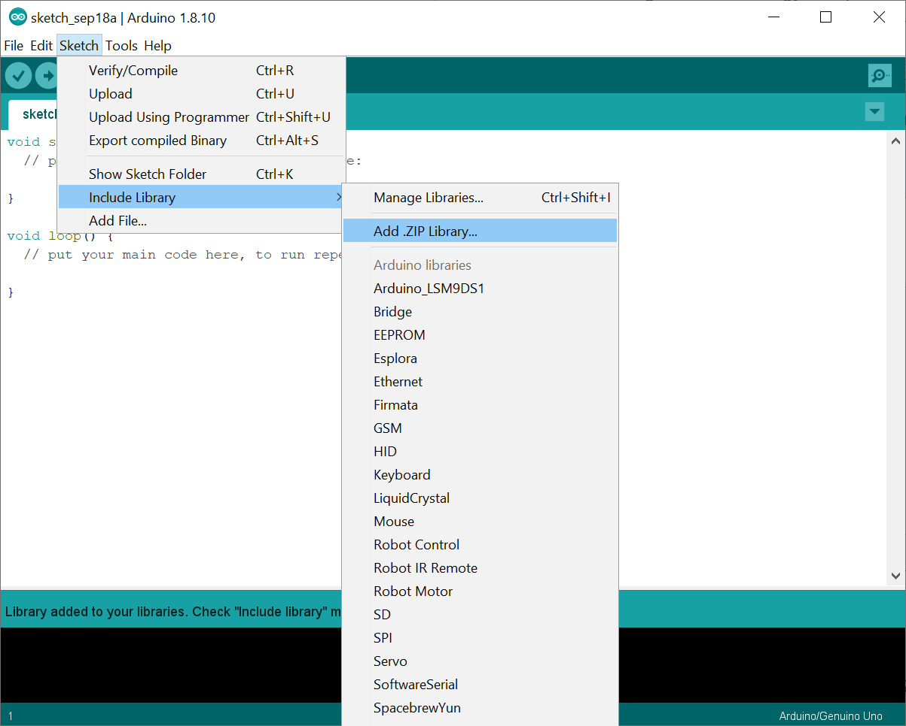

# Exercise 1 - Development Environment

Set up your computer for Arduino development.

## Arduino IDE
Install the Arduino IDE from https://arduino.cc/downloads

        
### Arduino SAMD Board Definitions
Use the Arduino Boards Manager to install the Arduino SAMD Board definitions. Open the Boards Manager using the menu _Tools -> Boards -> Boards Manager_

Search for "Nano 33 BLE" and install the Arduino nRF528x Boards (MBed OS) definitions.

        
### Arduino Libraries        
Install the following Arduino Libraries using the Library manager. 

* Arduino LSM9DS1 library (search for "Arduino_LSM9DS1")

Open the library manager using the menu _Tools ->  Manage Libraries_

Search for "Arduino_LSM9DS1". Click the row and press the +Install+ button to install the Arduino LSM9DS1 accelerometer, magnetometer, and gyroscope library. 

The TensorFlow Lite library isn't available in the Arduino Library Manager yet.

1. Download the zip file [tensorflow_lite.zip](https://storage.googleapis.com/tensorflow-nightly/github/tensorflow/tensorflow/lite/experimental/micro/tools/make/gen/arduino_x86_64/prj/tensorflow_lite.zip)
2. Import downloaded library into the IDE using _Sketch -> Include Library -> Add .ZIP library ..._

++ TODO link to setup instructions for Linix users and permissions ++

Next [Exercise 2: Assemble the Hardware](exercise2.md)
