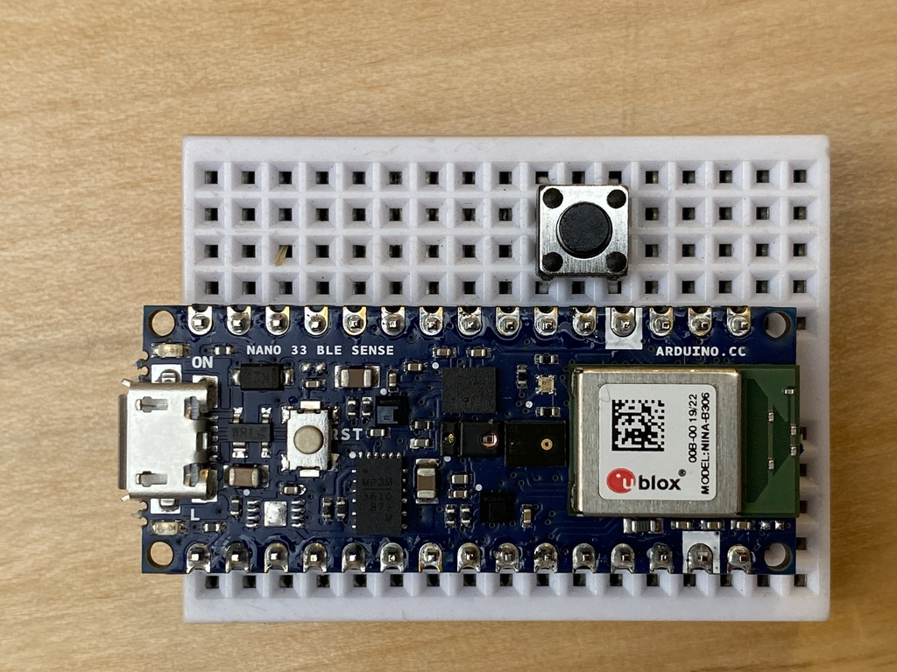

# Exercise 2: Assemble the Hardware

1. Remove the Arduino Nano 33 Sense board from the box
1. Hold the Arduino with the USB connector toward the right
1. Plug the Arduino into the top of the mini solderless breadboard
1. You should see 4 rows of holes below the board
1. Take the button and gently insert it into the breadboard
1. The left side of the button should be in the ground pin, which is denoted by a white mark
1. The right side of the button should be in pin D3
1. Unfortuantely the pin labels are on the bottom of the board, so match your setup with the picture above.

## Hardware Test

1. Plug the micro USB cable into the board and your computer
1. Open ArduinoSketches/HardwareTest/HardwareTest.ino in the Arduino IDE
1. Choose the board _Tools -> Board -> Arduino Nano 33 BLE_
1. Choose the port _Tools -> Port -> COM5 (Arduino Nano 33 BLE)_ Note that the actual port may be different on your computer
1. Upload the code to the board _Sketch -> Upload_
1. Press the button and the on-board LED will light up
1. Release the button and the on-board LED will shut off
1. Open the serial monitor _Tools -> Serial Monitor_ to see debug messages

## LSM9DS1 Examples (Optional)

You can try the example sketches that came with the LSM9DS1 library.

1. Open the Simple Accelerometer sketch using _File -> Examples -> Arduino_LSM9DS1 -> SimpleAccelerometer_
1. Upload the sketch to the board using the _Sketch -> Upload_ menu or the right arrow button from the tool bar.
1. Open the Serial Monitor _Tools -> Serial Monitor_ to view the text output
1. Open the Serial Plotter _Tools -> Serial Plotter_ to view the output on a graph

Next [Exercise 3: Visualize the IMU Data](exercise3.md)
